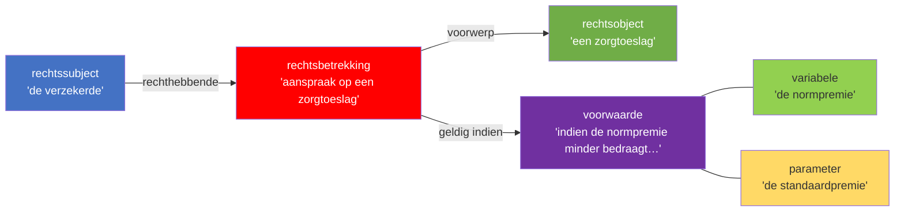

# Juridisch Analyseschema (JAS) — Annotatiekaders v1.0.10

> Gebaseerd op: *Wetsanalyse met het juridisch analyseschema*, vastgesteld 29 november 2024  
> Uitgever: MinBZK Informatiemodel | Licentie: CC0 | Canonieke URL: https://regels.overheid.nl/standaarden/wetsanalyse/v1.0.10  
> Theoretische basis: A. Ausems, J. Bulles & M. Lokin (Boom uitgevers Den Haag) / W.N. Hohfeld (1913)

---

## Doel

Het JAS maakt het mogelijk wetgeving expliciet en gestructureerd te annoteren zodat:
- interpretatie- en preciseringskeuzes traceerbaar zijn;
- bij wetswijziging gemakkelijk te bepalen is welke aanpassingen nodig zijn;
- een samenhangend kennismodel voor ICT-implementatie kan worden opgesteld.

Centraal principe: **elke conclusie moet terug te voeren zijn op wetgeving of officieel vastgesteld uitvoeringsbeleid.** Hierbij is multidisciplinaire samenwerking tussen juristen, informatieanalisten en ICT-ontwikkelaars essentieel om tot een gevalideerde en uitvoerbare analyse te komen.

---

## Methodologische stappen

| Stap | Omschrijving |
|------|-------------|
| 1. Werkgebied bepalen | Scopebepaling: welke wetgeving en welk uitvoeringsbeleid valt binnen de analyse. |
| 2. Structuur zichtbaar maken | Juridische "grammatica" identificeren; formuleringen classificeren in JAS-klassen. |
| 3. Betekenis vastleggen | Begrippen definiëren; interpretatie- en preciseringskeuzes expliciet vastleggen. |
| 4. Analyseresultaten valideren | Toetsing in multidisciplinair team met concrete voorbeelden en scenario's. |
| 5. Ontbrekend beleid signaleren | Identificeren van lacunes in uitvoeringsbeleid en wetgeving. |
| 6. Kennismodel opstellen | Het samenhangende conceptuele model afronden voor ICT-implementatie. |

---

## Taxonomie JAS-elementen

```text
rechtssubject
rechtsobject
rechtsbetrekking
delegatiebevoegdheid
  └── delegatie-invulling
rechtsfeit
voorwaarde
  └── afleidingsregel
        ├── operator
        ├── variabele
        │     ├── variabelewaarde
        │     ├── tijdsaanduiding
        │     └── plaatsaanduiding
        └── parameter
              └── parameterwaarde
brondefinitie
```

---

## Annotatieregels per JAS-element

### 1. Rechtssubject

| Veld | Inhoud |
|------|--------|
| **Definitie** | Drager van rechten en plichten; partij in een rechtsbetrekking. Natuurlijke persoon of rechtspersoon. |
| **Herkenningsvraag** | *Wie* heeft het recht? *Wie* heeft de plicht? *Van wie* is een rechtsobject? *Bij wie* hoort een waarde? |
| **Taalkenmerken** | Zelfstandig naamwoord voor een persoon/entiteit; persoonlijk voornaamwoord (hij, zij, het); onbepaald/betrekkelijk voornaamwoord (iemand, een ieder, degene). |
| **Invorderingscontext** | Belastingschuldige (art. 3 IW 1990), ontvanger, aansprakelijkgestelde, schuldeiser, Staat. |

---

### 2. Rechtsobject

| Veld | Inhoud |
|------|--------|
| **Definitie** | Voorwerp van een rechtsbetrekking of rechtsfeit. Kan een fysieke (bijv. auto, huis) of niet-fysieke verschijningsvorm (bijv. medische zorg) hebben. |
| **Herkenningsvraag** | *Wat* is het voorwerp van een recht of plicht? *Waar* is het rechtssubject eigenaar of houder van? *Waarover* is iets verschuldigd? |
| **Taalkenmerken** | Zelfstandig naamwoord voor het onderwerp van de rechtsbetrekking; aanwijzend/betrekkelijk voornaamwoord (dat, hetgeen, welke). |
| **Invorderingscontext** | Belastingaanslag, naheffingsaanslag, dwangbevel, beslag, vordering, vermogensbestanddeel. |

---

### 3. Rechtsbetrekking

| Veld | Inhoud |
|------|--------|
| **Definitie** | Juridische relatie tussen twee rechtssubjecten: één rechthebbend, één plichthebbend. |
| **Herkenningsvraag** | *Hoe verhouden* twee rechtssubjecten zich tot elkaar? *Welke relatie(s)* hebben twee rechtssubjecten met elkaar? |
| **Taalkenmerken** | Werkwoord + hulpwerkwoord: recht (kan verzoeken, mag), plicht (stelt vast, is verplicht, dient te). Samengesteld: heeft recht op, heeft aanspraak op. |
| **Invorderingscontext** | Betalingsplicht (art. 7 IW 1990), aanmaning, dwangbevel, uitstel van betaling, kwijtschelding. |

---

### 4. Rechtsfeit

| Veld | Inhoud |
|------|--------|
| **Definitie** | Handeling, gebeurtenis of tijdsverloop waaraan rechtsgevolgen zijn verbonden die een rechtsbetrekking creëren, wijzigen of beëindigen. |
| **Herkenningsvraag** | *Wat* is de gebeurtenis, de handeling of het tijdsverloop dat gevolgen heeft voor de rechtsbetrekking? |
| **Taalkenmerken** | Actieve werkwoordsvorm (al dan niet met zelfstandig naamwoord): indienen van bezwaar, betekenen van dwangbevel, verstrijken van termijn. |
| **Invorderingscontext** | Dagtekening aanslag, verstrijken betalingstermijn, betekening dwangbevel, aanvraag uitstel, indiening bezwaarschrift. |

---

### 5. Voorwaarde

| Veld | Inhoud |
|------|--------|
| **Definitie** | Conditie die beschrijft aan welke omstandigheid voldaan moet zijn voor het intreden van een rechtsgevolg. Enkelvoudig of samengesteld (cumulatief EN / alternatief OF / negatie NIET). |
| **Herkenningsvraag** | *Welke eisen* worden gesteld? *Onder welke omstandigheden* geldt een bepaald rechtsgevolg? |
| **Taalkenmerken** | Voegwoorden: indien, als, tenzij, mits, met dien verstande dat, met uitzondering van; bijwoorden bij werkwoord: schriftelijk, elektronisch. |
| **Invorderingscontext** | Voorwaarden voor uitstel (art. 25 IW 1990), kwijtscheldingscriteria (art. 26 IW 1990), aansprakelijkheidsdrempel. |

---

### 6. Afleidingsregel

| Veld | Inhoud |
|------|--------|
| **Definitie** | Regel die nieuwe feiten of waarden creëert op basis van bestaande feiten of waarden. Vier typen: **Beslissingsregel** (ja/nee, recht bestaat of niet), **Rekenregel** (bedrag, duur, hoogte), **Beperkingsregel** (beperkt of maximeert een waarde of recht), **Specialisatieregel** (specificeert een hoofdregel voor een deelgeval via "in afwijking van"-constructie). Zie `kaders-regels.md` voor taalpatronen per type. |
| **Herkenningsvraag** | *Hoe wordt* een variabele berekend of afgeleid? *Hoe wordt* een specifiek rechtssubject of rechtsobject bepaald? |
| **Taalkenmerken** | Is verminderd met, bedraagt vermeerderd met, wordt gesteld op, is het gezamenlijke bedrag van, berekend naar. |
| **Invorderingscontext** | Berekening invorderingsrente (art. 28 IW 1990), vaststelling openstaand bedrag, belastingschuld na verrekening. |

---

### 7. Variabele / Variabelewaarde

| Veld | Inhoud |
|------|--------|
| **Definitie** | **Variabele**: Specifiek kenmerk of eigenschap van een rechtssubject, rechtsobject, rechtsbetrekking of rechtsfeit. **Variabelewaarde**: De concrete waarde hiervan. |
| **Typen variabelewaarden** | (1) Getal/datum; (2) Tekst; (3) Enumeratiewaarde (limitatieve opsomming); (4) Booleaanse waarde (ja/nee). |
| **Herkenningsvraag** | *Wat zijn de specifieke kenmerken?* *Welk bedrag, welke duur of welke hoogte* hoort bij dit object of feit? |
| **Invorderingscontext** | Verschuldigd belastingbedrag, betalingstermijn, datum aanslag, inkomen belastingschuldige. |

---

### 8. Parameter / Parameterwaarde

| Veld | Inhoud |
|------|--------|
| **Definitie** | **Parameter**: Constante waarde over een bepaalde periode, gelijk voor alle instanties. **Parameterwaarde**: De concrete waarde voor die periode (bijv. een tarief of drempel). |
| **Herkenningsvraag** | Is er sprake van een waarde die gedurende een periode *voor iedereen gelijk* is? |
| **Taalkenmerken** | Tarieven, (drempel)bedragen, maxima, minima, vrijstellingen; uitgedrukt in bedrag, percentage of datum. |
| **Invorderingscontext** | Invorderingsrentevoet (art. 29 IW 1990), wettelijk rentepercentage, griffierecht bedragen. |

---

### 9. Operator

| Veld | Inhoud |
|------|--------|
| **Definitie** | Woord, combinatie van woorden of teken dat een rekenkundige bewerking, samengestelde voorwaarde, gelijkstelling of vergelijking uitdrukt. |
| **Typen** | (a) **Rekenkundig**: +, −, ×, ÷ ; (b) **Vergelijking**: groter dan, kleiner dan, gelijk aan; (c) **Logisch**: EN, OF, NIET. |
| **Taalkenmerken** | De som van, vermeerderd met, verminderd met, percentage van, meer bedraagt dan, ten minste, niet. |
| **Invorderingscontext** | Berekening invorderingsrente: "vermeerderd met"; voorwaarden bij aansprakelijkheid: cumulatieve EN-operator. |

---

### 10. Tijdsaanduiding

| Veld | Inhoud |
|------|--------|
| **Definitie** | Omschrijving van een tijdstip of tijdvak; duidt geldigheid van een rechtsbetrekking, tijdsverloop met rechtsgevolg, of een peildatum. |
| **Herkenningsvraag** | *Wanneer?* Vanaf welk of tot welk moment? |
| **Taalkenmerken** | Concrete datum (1 januari 2025); omschrijving (de eerste dag van de maand); periodewoorden (jaar, maand, week, dag). |
| **Invorderingscontext** | Betalingstermijn van 6 weken (art. 9 IW 1990), aanvang invorderingsrente, verjaringstermijnen. |

---

### 11. Plaatsaanduiding

| Veld | Inhoud |
|------|--------|
| **Definitie** | Plaats of gebied waarvoor de wetgeving geldt of die bepalend is voor de juridische context. |
| **Herkenningsvraag** | *Waar* (voor welk gebied) geldt de regel (niet)? |
| **Taalkenmerken** | Algemeen (een lidstaat van de EU) of specifiek (Nederland, gemeente Amsterdam). |
| **Invorderingscontext** | Fiscale woonplaats, vestigingsplaats, grensoverschrijdende invordering. |

---

### 12. Delegatiebevoegdheid / Delegatie-invulling

| Veld | Inhoud |
|------|--------|
| **Definitie** | **Delegatiebevoegdheid**: De bevoegdheid om regels nader uit te werken in lagere regelgeving. **Delegatie-invulling**: De daadwerkelijke gedelegeerde regeling. Dit kader omvat uitsluitend delegatie strikt sensu (overdracht van regelgevende bevoegdheid). Mandaat (bevoegdheidsuitoefening namens een ander) en attributie (wettelijke toekenning van een nieuwe bevoegdheid) vallen buiten dit JAS-element. |
| **Herkenningsvraag** | Geeft een bepaling *opdracht* nadere regels te stellen? Verwijst de tekst *naar een hogere wet*? |
| **Taalkenmerken** | Verplicht: "worden regels gesteld bij amvb" / "worden nadere regels gesteld". Facultatief: "kunnen regels worden gesteld" / "kan bij amvb worden bepaald". |
| **Type-beslisregel** | **Verplicht**: passieve werkwoordsvorm zonder "kunnen" — de wetgever schrijft voor dat lagere regelgeving wordt vastgesteld. **Facultatief**: "kan" of "kunnen" in de delegatiezin — de wetgever staat lagere regelgeving toe maar schrijft het niet voor. Bij twijfel: is het mogelijk dat de gemachtigde wetgever géén nadere regels stelt zonder dat de wet wordt geschonden? Ja → facultatief. |
| **Invorderingscontext** | Art. 73 IW 1990 → Uitvoeringsbesluit IW 1990 (UBIB 1990). |

---

### 13. Brondefinitie

| Veld | Inhoud |
|------|--------|
| **Definitie** | Begripsomschrijving die expliciet is opgenomen in de wetgeving en daardoor een eenduidige betekenis verankert. |
| **Herkenningsvraag** | Is deze term *uitdrukkelijk omschreven* in de wettekst zelf? |
| **Taalkenmerken** | Artikel met aanhef + onderdelen (bijv. "In deze wet en de daarop berustende bepalingen wordt verstaan onder:"). |
| **Invorderingscontext** | Art. 3 IW 1990 (belastingschuldige, ontvanger), art. 1 AWR (rijksbelastingen). |

---

## Annotatieprincipes

1. **Lees de wetstekst altijd eerst.** Snippets of losse zoekresultaten zijn nooit voldoende grondslag.
2. **Citeer precies.** Koppel elk geclassificeerd element aan het exacte artikel, lid en zinsdeel.
3. **Kies de meest specifieke klasse.** Tijdsaanduiding is specifieker dan variabele; plaatsaanduiding is specifieker dan parameter.
4. **Interpretatie expliciet benoemen.** Leg grammaticale, systematische, teleologische en wetshistorische afwegingen vast. Vier erkende methoden (Handleiding §3.5.3): grammaticaal (taalkundige betekenis), systematisch (samenhang met andere bepalingen), teleologisch (doel van de wet) en wetshistorisch (bedoeling wetgever uit wetsgeschiedenis).
5. **Spanning en meerduidigheid signaleren.** Benoem expliciet wanneer een bepaling dubbelzinnig is of conflicteert met andere regels.
6. **Delegatieketens traceren.** Breng altijd de volledige keten in kaart (wet → amvb → ministeriële regeling).

---

## Diagramregels (A2c)

Eén diagram per Rechtsbetrekking in het artikel. Bij meerdere Rechtsbetrekkingen: meerdere genummerde Mermaid-blokken in de `## Diagram`-sectie van de annotatie-noot, elk voorzien van een label (`subgraph` of commentaarregel met lid + omschrijving).

### Centrale klasse

Prioriteitsvolgorde voor de centrale knoop (gebruik de eerste die aanwezig is):

1. **Rechtsbetrekking** — altijd eerste keuze
2. **Rechtsfeit** — als geen Rechtsbetrekking aanwezig is
3. **Afleidingsregel** — als het artikel primair een berekening of beslissing beschrijft zonder expliciete rechtsbetrekking of rechtsfeit
4. **Voorwaarde** — als het artikel primair een conditie of begrenzing beschrijft en geen van de bovenstaande klassen aanwezig is

> **Noot:** De markeringsregel "begin bij rechtsbetrekking en rechtsfeit" beschrijft de annotatievolgorde (wat eerst markeren), niet de diagramcentrum-selectie. Het diagram-centrum volgt de prioriteitsvolgorde hierboven — die kan afwijken van de annotatiestartpunt als een Afleidingsregel of Voorwaarde de kern van het artikel vormt.

Alleen als alle vier ontbreken: schrijf exact `Geen centrale klasse gevonden; diagram niet van toepassing.`

### Randlabels per JAS-klasse-combinatie

| Van (knoop) | Naar (knoop) | Randlabel |
|-------------|-------------|-----------|
| Rechtssubject | Rechtsbetrekking | `rechthebbende` of `plichthebbende` |
| Rechtsbetrekking | Rechtsobject | `voorwerp` |
| Rechtsbetrekking | Voorwaarde | `geldig indien` |
| Rechtsbetrekking | Afleidingsregel | `nader uitgewerkt in` |
| Rechtsfeit | Rechtsbetrekking | `triggert` |
| Rechtsfeit | Afleidingsregel | `triggert` |
| Afleidingsregel | Variabele | `gebruikt` |
| Afleidingsregel | Parameter | `gebruikt` |
| Voorwaarde | Variabele | *(ongelabeld)* |
| Voorwaarde | Parameter | *(ongelabeld)* |
| Voorwaarde | Tijdsaanduiding | *(ongelabeld)* |
| Voorwaarde | Plaatsaanduiding | *(ongelabeld)* |
| Delegatiebevoegdheid | Rechtsbetrekking | `gemandateerd aan` |

### Extra knooptypes opnemen in het diagram

Voeg naast Rechtssubject/Rechtsobject ook de volgende elementen op als ze in de annotatietabel voorkomen **en** direct verbonden zijn aan de centrale rechtsbetrekking of het rechtsfeit van het diagram:

| JAS-klasse | Wanneer opnemen | Verbinding |
|-----------|----------------|-----------|
| Voorwaarde | Altijd bij aanwezigheid | RB →\|geldig indien\| VW |
| Rechtsfeit | Altijd bij aanwezigheid | RF →\|triggert\| RB |
| Afleidingsregel | Bij directe uitwerking van RB | RB →\|nader uitgewerkt in\| AR |
| Delegatiebevoegdheid | Bij aanwezigheid | DB →\|gemandateerd aan\| RB |
| Variabele / Parameter | Alleen als onderdeel van een Voorwaarde of Afleidingsregel in hetzelfde diagram | VW --- VA / AR →\|gebruikt\| VA |

Neem **géén** losse variabelen of parameters op die niet gekoppeld zijn aan een Voorwaarde of Afleidingsregel in hetzelfde diagram — dit houdt het diagram leesbaar.

Rechtssubjecten die als plichthebbende optreden (kenbaar uit de rechtsbetrekking-formulering) krijgen het label `plichthebbende`; de rechthebbende krijgt `rechthebbende`. Bij twijfel: gebruik `rechtssubject`.

### Knooplabel-formaat

```
"[JAS-klasse]<br/>'[markering ingekort tot max. 40 tekens]'"
```

Markering inkorten: neem de eerste 4–6 woorden, eindigend op een zelfstandig naamwoord of werkwoord; laat hulpwerkwoorden weg; voeg `…` toe indien afgekort. Maximum: 40 tekens inclusief `…`. Bij markeringen zonder zelfstandig naamwoord (bijv. puur werkwoordelijk): neem de actieve werkwoordsvorm als startpunt.

### classDef per JAS-klasse (Mermaid)

```
classDef rb   fill:#FF0000,color:#fff
classDef rs   fill:#4472C4,color:#fff
classDef ro   fill:#70AD47,color:#fff
classDef rf   fill:#FFC000
classDef vw   fill:#7030A0,color:#fff
classDef ar   fill:#00B0F0
classDef va   fill:#92D050
classDef pa   fill:#FFD966
classDef ta   fill:#F4B942
classDef pl   fill:#9DC3E6
classDef db   fill:#C9C9C9
classDef bd   fill:#D6B4C8
classDef op   fill:#808080,color:#fff
```

Klasse-afkorting per element: `rb` Rechtsbetrekking · `rs` Rechtssubject · `ro` Rechtsobject · `rf` Rechtsfeit · `vw` Voorwaarde · `ar` Afleidingsregel · `va` Variabele · `pa` Parameter · `ta` Tijdsaanduiding · `pl` Plaatsaanduiding · `db` Delegatiebevoegdheid · `bd` Brondefinitie · `op` Operator.

### Voorbeeld (enkelvoudige rechtsbetrekking)

````markdown
## Diagram

### Diagram 1 — lid 1: aanspraak op zorgtoeslag


````

---

## Kleurcodering (indicatief voor tools)

> **Let op:** De onderstaande kleurcodes zijn gebaseerd op gangbare implementaties van JAS-annotatie­tools. De officiële JAS-specificatie v1.0.10 schrijft geen vaste kleurwaarden voor.

| Element | Kleurcode | Element | Kleurcode |
|---------|-----------|---------|-----------|
| **Rechtssubject** | `#4472C4` (blauw) | **Parameter / waarde** | `#FFD966` (geel) |
| **Rechtsobject** | `#70AD47` (groen) | **Operator** | `#808080` (grijs) |
| **Rechtsbetrekking** | `#FF0000` (rood) | **Tijdsaanduiding** | `#F4B942` (goudgeel) |
| **Rechtsfeit** | `#FFC000` (oranje) | **Plaatsaanduiding** | `#9DC3E6` (lichtblauw) |
| **Voorwaarde** | `#7030A0` (paars) | **Delegatiebevoegdheid** | `#C9C9C9` (lichtgrijs) |
| **Afleidingsregel** | `#00B0F0` (lichtblauw) | **Brondefinitie** | `#D6B4C8` (roze) |
| **Variabele / waarde** | `#92D050` (lichtgroen) | | |

---

## Referenties

- **JAS v1.0.10:** https://regels.overheid.nl/standaarden/wetsanalyse/v1.0.10  
- **Boek:** Ausems, A., Bulles, J. & Lokin, M. *Wetsanalyse, Voor een werkbare uitvoering van wetgeving met ICT.* Boom uitgevers Den Haag.
- **NL-SBB (begrippenkader):** https://docs.geostandaarden.nl/nl-sbb/nl-sbb/  
- **Hohfeld (1913/1917):** *Fundamental Legal Conceptions as Applied in Judicial Reasoning*, Yale Law Journal.
