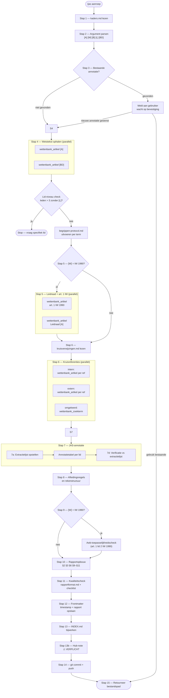

# JAS-workflow — visueel overzicht

> Beschrijvend diagram. Het uitvoeringsprotocol staat in `PROTOCOL.md`.  
> Bij verschil tussen dit diagram en `PROTOCOL.md` is `PROTOCOL.md` leidend.

---

## Flowchart

---

## Leeswijzer parallelle aanroepen

| Stap | Parallel aanroepen |
|------|--------------------|
| 4 | `wettenbank_artikel [A]` + `wettenbank_artikel [BD]` |
| 5 | `wettenbank_artikel art. 1 IW 1990` + `wettenbank_artikel Leidraad [A]` |
| 6 | interne refs + externe refs + `wettenbank_zoekterm` omgekeerd |

## Conditionele stappen

| Stap | Conditie |
|------|----------|
| 5 | Alleen als `[W]` = IW 1990 of UB IW 1990 |
| 9 | Alleen als `[W]` = IW 1990 |
| §7.3 (rapport) | Alleen als `[W]` = IW 1990 |
| §8 (rapport) | Alleen als `[W]` = IW 1990 of UB IW 1990 |

## Sub-bestanden

| Bestand | Geladen in stap |
|---------|----------------|
| `../shared/bwb-mapping.md` | Stap 2 |
| `kaders.md` | Stap 1 |
| `begrippen-protocol.md` | Stap 4 |
| `../begrip/template.md` | Via begrippen-protocol (stap 4) |
| `kruisverwijzingen.md` | Stap 6 |
| `rapportformat.md` | Stap 11 |
