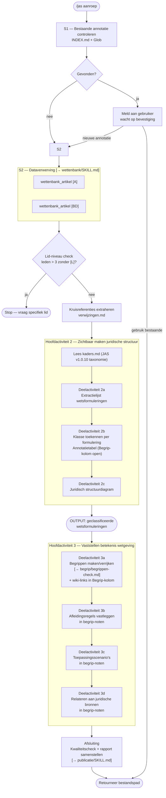

# JAS-workflow — visueel overzicht

> Beschrijvend diagram. Het uitvoeringsprotocol staat in `SKILL.md`.  
> Bij verschil tussen dit diagram en `SKILL.md` is `SKILL.md` leidend.

---

## Flowchart

---

## Parallelle aanroepen

| Stap | Parallel aanroepen |
|------|--------------------|
| S2 (dataverwerving) | `wettenbank_artikel [A]` + `wettenbank_artikel [BD]` |
| Kruisreferenties | interne refs + externe refs + `wettenbank_zoekterm` omgekeerd |

## Conditionele stappen

| Stap | Conditie |
|------|----------|
| S1B | Alleen als bestaande annotatie gevonden |
| STOP | Alleen als leden > 3 zonder lid-specificatie |
| Kruisreferenties parallel | Alleen als het JSON-model referenties bevat |
