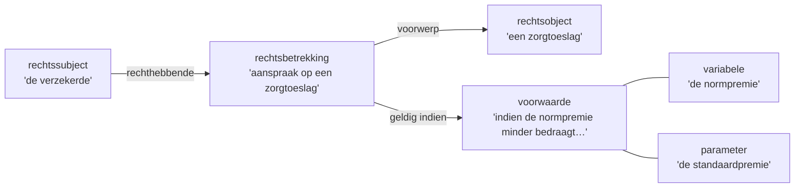

# Diagramregels (A2c)

> **Bron:** Handleiding Wetsanalyse §3.4.2c (p. 33-35). Diagram als brug A1↔A2↔A3 (p. 34). Gebruikt door `annoteer-diagram`.

---

## Wanneer een diagram

Eén diagram per Rechtsbetrekking in het lid. Meerdere Rechtsbetrekkingen → meerdere genummerde Mermaid-blokken, elk met een eigen label (lid + omschrijving).

## Centrale klasse — prioriteitsvolgorde

> Een centrale klasse "heeft relaties met andere klassen"; rechtsbetrekking en rechtsfeit zijn "doorgaans te vinden in de bij activiteit 1 opgestelde juridische scenario's" (Handleiding `handleiding.pages.md` r. 1605-1614). Neem waar mogelijk de rechtsbetrekking/het rechtsfeit uit het **happy scenario** als vertrekpunt — dat verankert de brugfunctie A1↔A2↔A3.

Gebruik de eerste die aanwezig is:

1. **Rechtsbetrekking** — altijd eerste keuze
2. **Rechtsfeit** — als geen Rechtsbetrekking aanwezig is
3. **Afleidingsregel** — als het lid primair een berekening of beslissing beschrijft
4. **Voorwaarde** — als het lid primair een conditie/begrenzing beschrijft

> De markeringsregel "begin bij rechtsbetrekking en rechtsfeit" gaat over de **annotatievolgorde**, niet over diagram-centrum-selectie. Het diagram-centrum volgt deze prioriteitsvolgorde.

**Valkuil (Handleiding r. 1722-1726):** neem alleen wetsformuleringen op die een relatie met de centrale klasse hebben of die klasse zelf vormen. Het diagram "voorkomt dat losse woorden gemarkeerd worden terwijl deze niet een relatie hebben met een centrale klasse". Losse knopen zonder rand zijn een signaal dat de markering of klasse heroverwogen moet worden.

Als alle vier ontbreken: noteer letterlijk `Geen centrale klasse gevonden; diagram niet van toepassing.`

## Knopen — welke opnemen

Naast Rechtssubject/Rechtsobject:

| JAS-klasse | Wanneer opnemen | Verbinding |
|-----------|----------------|-----------|
| Voorwaarde | Altijd bij aanwezigheid | RB →\|geldig indien\| VW |
| Rechtsfeit | Altijd bij aanwezigheid | RF →\|triggert\| RB |
| Afleidingsregel | Bij directe uitwerking van RB | RB →\|nader uitgewerkt in\| AR |
| Delegatiebevoegdheid | Bij aanwezigheid | DB →\|gemandateerd aan\| RB |
| Variabele / Parameter | Alleen als onderdeel van een Voorwaarde of Afleidingsregel in hetzelfde diagram | VW --- VA / AR →\|gebruikt\| VA |

Geen losse variabelen of parameters opnemen die niet gekoppeld zijn aan een Voorwaarde of Afleidingsregel in hetzelfde diagram (leesbaarheid).

## Randlabels per combinatie

| Van (knoop) | Naar (knoop) | Randlabel |
|-------------|-------------|-----------|
| Rechtssubject | Rechtsbetrekking | `rechthebbende` of `plichthebbende` |
| Rechtsbetrekking | Rechtsobject | `voorwerp` |
| Rechtsbetrekking | Voorwaarde | `geldig indien` |
| Rechtsbetrekking | Afleidingsregel | `nader uitgewerkt in` |
| Rechtsfeit | Rechtsbetrekking | `triggert` |
| Rechtsfeit | Afleidingsregel | `triggert` |
| Afleidingsregel | Variabele | `gebruikt` |
| Afleidingsregel | Parameter | `gebruikt` |
| Voorwaarde | Variabele/Parameter/Tijds-/Plaatsaanduiding | *(ongelabeld)* |
| Delegatiebevoegdheid | Rechtsbetrekking | `gemandateerd aan` |

Rechtssubjecten die als plichthebbende optreden (kenbaar uit de rechtsbetrekking) krijgen `plichthebbende`; rechthebbende krijgt `rechthebbende`. Bij twijfel: `rechtssubject`.

## Knooplabels

```
"[JAS-klasse]<br/>'[markering ingekort tot max. 40 tekens]'"
```

Inkorten: 4-6 woorden, eindigend op een zelfstandig naamwoord of werkwoord; hulpwerkwoorden weglaten; `…` als afgekort. Maximaal 40 tekens incl. `…`.

## Mermaid classDef (kleurcodering)

> De officiële JAS-specificatie v1.0.10 schrijft geen vaste kleurwaarden voor; onderstaande codering is **projectconventie**, gebaseerd op gangbare implementaties.

```
classDef rb   fill:#FF0000,color:#fff   %% Rechtsbetrekking
classDef rs   fill:#4472C4,color:#fff   %% Rechtssubject
classDef ro   fill:#70AD47,color:#fff   %% Rechtsobject
classDef rf   fill:#FFC000               %% Rechtsfeit
classDef vw   fill:#7030A0,color:#fff   %% Voorwaarde
classDef ar   fill:#00B0F0               %% Afleidingsregel
classDef va   fill:#92D050               %% Variabele
classDef pa   fill:#FFD966               %% Parameter
classDef ta   fill:#F4B942               %% Tijdsaanduiding
classDef pl   fill:#9DC3E6               %% Plaatsaanduiding
classDef db   fill:#C9C9C9               %% Delegatiebevoegdheid
classDef bd   fill:#D6B4C8               %% Brondefinitie
classDef op   fill:#808080,color:#fff   %% Operator
```

Afkortingen: `rb` `rs` `ro` `rf` `vw` `ar` `va` `pa` `ta` `pl` `db` `bd` `op`.

## Voorbeeld

````markdown

````
