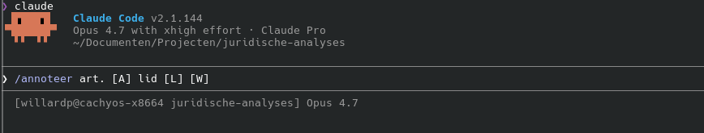

# Juridische wetsanalyse - kennisgraaf voor de invorderingspraktijk


[](https://palmw01.github.io/juridische-analyses)

Dit project is een proof-of-concept voor AI-ondersteunde wetsanalyse binnen de invordering van rijksbelastingen. Het laat zien hoe een taalmodel de arbeidsintensieve delen van de Wetsanalyse-methodiek kan ondersteunen: wettekst annoteren, juridische begrippen vastleggen, afleidingsregels formuleren en voorbeeldreeksen voorbereiden voor menselijke validatie.

De huidige scope bestaat uit art. 9 Invorderingswet 1990, art. 2 lid 2 Invorderingswet 1990 en relevante onderdelen uit de Leidraad Invordering 2008 (§9.1 en §9.5). Het resultaat is een traceerbaar kennismodel dat beschikbaar is als YAML/JSON-bronbestanden, RDF/SKOS, GEXF/GraphML en een statische webapp.

[Bekijk de webapp](https://palmw01.github.io/juridische-analyses) · [Validatierapport](./rapporten/validatie-rapport.md) · [Methodiekdocumentatie](./docs/wetsanalyse-methodiek/source-index.md)



## Wat levert het op

De repository bevat een volledig doorlopen analyseketen voor de huidige PoC-scope:

| Product | Inhoud |
|---|---|
| Begrippenstelsel | 45 juridische begrippen met definitie, herkomst, relaties en traceerbaarheid |
| Afleidingsregels | 15 formele regels in RegelSpraak-oriëntatie |
| Voorbeeldreeksen | 15 A4b-testmatrices voor juridische beoordeling |
| Kennisgraaf | RDF/SKOS, GEXF en GraphML exports |
| Validatie | L1-schema, L2-integriteit en L3-kwaliteitswaarschuwingen |
| Webapp | Doorzoekbare statische site met begrippen, annotaties, regels, graaf en SPARQL |

De kernkwaliteit is traceerbaarheid. Elk begrip en elke regel verwijst terug naar een annotatie, markering en bronfragment. Daardoor is zichtbaar welke juridische tekst aan een modelonderdeel ten grondslag ligt.

## Voor wie

| Rol | Wat biedt dit |
|---|---|
| Jurist invordering | Analyse van art. 9 IW en Leidraad Invordering met herleidbare definities en regels |
| Gegevensspecialist | Machineleesbare begrippen, JSON Schema, RDF/SKOS en graafexports |
| Regelanalist | Afleidingsregels met invoer- en uitvoerbegrippen en A4b-voorbeeldreeksen |
| Wetsanalist / methodiekbureau | Werkend voorbeeld van JAS-gebaseerde wetsanalyse met AI-audit trail |

## Status

Dit is een werkende PoC voor de huidige scope. De analyse is breed genoeg om de methode, tooling en publicatieketen te demonstreren, maar niet bedoeld als volledige modellering van de Invorderingswet.

| Onderdeel | Stand |
|---|---|
| Scope | Art. 9 IW, art. 2 lid 2 IW, §9.1 en §9.5 Leidraad Invordering |
| Model | 45 begrippen, 15 afleidingsregels, 15 voorbeeldreeksen |
| Validatie | 82 projectbestanden, 0 blokkerende fouten, 19 L3-waarschuwingen |
| Publicatie | GitHub Pages-webapp beschikbaar |
| Fase | PoC afgerond voor huidige scope; doorontwikkeling volgt |

De L3-waarschuwingen zijn niet blokkerend. Ze markeren aandachtspunten zoals nog te beoordelen voorbeeldreeksen, bewust losse operatorbegrippen of scenario-specifieke begripsnamen uit concrete wetstekstvoorbeelden.

## Hoe de analyse werkt

De workflow volgt de activiteiten A1-A6 uit de Wetsanalyse-methodiek. AI ondersteunt vooral A2, A3 en A4b; juridische beoordeling en governance blijven menselijke taken.

```text
A1  Werkgebied bepalen                  handmatig
     |
     v
A2  Markeren en classificeren           AI-ondersteund
     wetstekst -> JAS-annotaties
     |
     v
A3  Betekenis vastleggen                AI-ondersteund
     annotaties -> begrippen en regels
     |
     v
A4b Voorbeeldreeksen opstellen          AI-ondersteund
     regels -> testmatrices
     |
     v
A4  Valideren                           juridisch team
A5  Signaleren                          juridisch team
A6  Kennismodel opstellen               modellering en governance
```

De Claude Code-workflow gebruikt onder meer deze commando's:

```text
/wettenbank art. [A] [W]          wetstekst ophalen
/annoteer art. [A] [W]            artikelstructuur annoteren
/annoteer art. [A] lid [L] [W]    lid annoteren
/begrip-alles art. [A] [W]        begrippen en regels vastleggen
/valideer AR-[id]                 voorbeeldreeks opstellen
```

Meer detail staat in [docs/model.md](./docs/model.md) en [docs/validatie.md](./docs/validatie.md).

## Traceerbaarheid

Elk eindproduct is via een vaste keten terug te voeren op de bron:

```text
wetstekst
  -> bronbestand in bronnen/
    -> annotatie in annotaties/
      -> markering-id
        -> begrip in begrippen/
          -> regel in regels/
            -> voorbeeldreeks in validaties/
```

Die keten maakt de analyse controleerbaar: een definitie of regelformulering staat niet los van de juridische bron, maar wijst terug naar de exacte annotatie waarop zij is gebaseerd.

## Aan de slag

```bash
git clone git@github.com:palmw01/juridische-analyses.git
cd juridische-analyses

# Venv, dependencies en hooks
make setup

# Controleer projectbestanden
make validate

# Genereer exports en voer de standaardchecks uit
make ci

# Genereer de statische webapp
make webapp
```

Bij elke commit draait de pre-commit hook met validatie. Bij push naar `main` draaien GitHub Actions voor validatie, exports en publicatie van de webapp.

Zie [docs/handleiding.md](./docs/handleiding.md) voor de volledige workflow met Claude Code-commando's.

## Belangrijkste mappen

```text
bronnen/       genormaliseerde wetstekst uit wetten.overheid.nl
annotaties/    A2 JAS-annotaties per artikel en lid
begrippen/     A3a begrippen als YAML
regels/        A3b afleidingsregels als YAML
validaties/    A4b voorbeeldreeksen als YAML
schemas/       JSON Schema voor L1-validatie
kennisgraaf/   RDF/SKOS, GEXF en GraphML exports
rapporten/     validatierapporten en runrapporten
sitegen/       generator voor de statische webapp
tools/         validatie-, export- en hulpscripts
tests/         Python-testsuite
webapp/        gegenereerde statische site
```

Zie [docs/technische-referentie.md](./docs/technische-referentie.md) voor de volledige toolchain, Make-targets en testopzet.

## Validatie

De projectbestanden worden op drie niveaus gecontroleerd:

| Laag | Controle | Blokkerend |
|---|---|---|
| L1 | JSON Schema-conformiteit (incl. conditionele `if/then`-regels op status, herkomst, regelsoort en testkolommen) | Ja |
| L2 | Referenties, statussen, diagrammen, regelkoppelingen en synonieme veldkoppelingen | Ja |
| L3 | Kwaliteitswaarschuwingen en review-signalen | Nee |

Het volledige rapport staat in [rapporten/validatie-rapport.md](./rapporten/validatie-rapport.md). De uitgebreide uitleg van de validatielaag staat in [docs/validatie.md](./docs/validatie.md).

## Standaarden en formaten

Dit project gebruikt:

| Onderdeel | Standaard / formaat |
|---|---|
| Juridische analyse | Wetsanalyse-methodiek en JAS v1.0.10 |
| Begrippenpublicatie | RDF Turtle en SKOS |
| Regelmodellering | RegelSpraak-orientatie |
| Graafexports | GEXF en GraphML |
| Validatie | JSON Schema draft-07 |
| Webapp | Statische HTML/CSS/JS via `sitegen/` |

Een uitleg van JAS, SKOS, RDF en RegelSpraak staat in [docs/model.md](./docs/model.md).

## Verantwoording

Deze werkruimte implementeert de Wetsanalyse-methodiek van het Ministerie van BZK, gebaseerd op het Juridisch Analyseschema (JAS) v1.0.10. A2, A3 en A4b worden door AI ondersteund. Het juridisch oordeel over voorbeeldreeksen en de formele validatie in teamverband blijven buiten de AI-scope.

Kaders: [JAS-taxonomie](./.claude/skills/kaders/jas-taxonomie.md) · [Definitie](./.claude/skills/kaders/definitie.md) · [Regeltypen](./.claude/skills/kaders/regeltypen.md) · [Voorbeeldreeks](./.claude/skills/kaders/voorbeeldreeks.md) · [Canon-ankers](./.claude/skills/kaders/canon-ankers.md) · [Projectconventies](./.claude/skills/kaders/projectconventies.md) · [BWB-mapping](./.claude/skills/wettenbank/bwb-mapping.md)

De skills volgen de [Anthropic Agent Skills-spec](https://agentskills.io/specification) (`name` + `description` in frontmatter) met een projectconventie voor body-secties (Doel/Trigger/Invoer/Werkwijze/Output/Vervolg/Kwaliteitseisen/Bronnen) — zie [`.claude/skills/KADERS.md §Skill-sjabloon`](./.claude/skills/KADERS.md).
