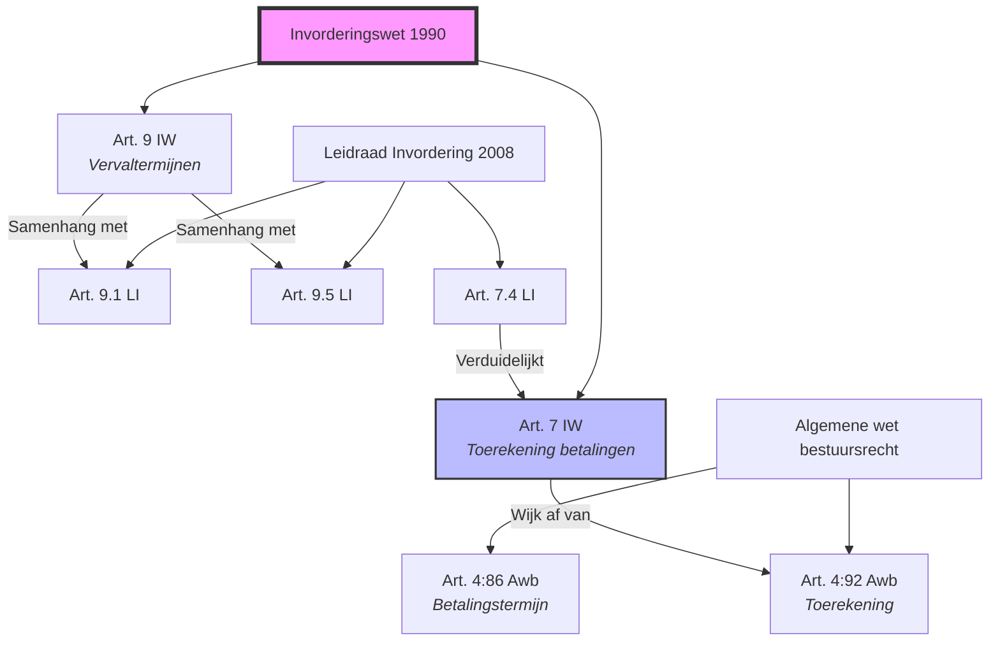
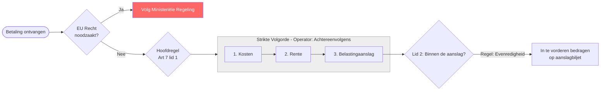

# Visueel Overzicht Juridische Analyses

Dit bestand biedt een visuele representatie van de samenhang tussen de geanalyseerde wetsartikelen en de interne logica van de JAS-annotaties.

## 1. De Juridische Kenniskaart (Knowledge Graph)
Deze grafiek toont hoe de verschillende wetten en artikelen in jouw analyses met elkaar verbonden zijn via verwijzingen en hiërarchie.

## 2. Logische Flow: Art. 7 IW 1990 (JAS-gebaseerd)
Hieronder zie je hoe de JAS-elementen (Voorwaarden, Objecten, Regels) uit je analyse van Artikel 7 een beslisboom vormen.

## 3. Innovatie-idee: "Complexity Heatmap"
Als we dit verder trekken, kunnen we per artikel een 'score' berekenen op basis van je JAS-tabellen:
- **Veel Rechtsobjecten?** Hoge informatiedichtheid.
- **Veel Voorwaarden?** Hoge juridische complexiteit.
- **Veel Operators?** Hoge rekenkundige complexiteit.

| Artikel | Info Score | Complexiteit | Status |
| :--- | :---: | :---: | :--- |
| Art. 7 IW | Medium | Medium | ✅ Geannoteerd |
| Art. 9 IW | High | High | 🔄 3 versies |
| Art. 4:86 Awb | Low | Low | ✅ Geannoteerd |

---
*Tip: Gebruik een Markdown-viewer met Mermaid-ondersteuning (zoals VS Code, Obsidian of GitHub) om de grafieken te bekijken.*
