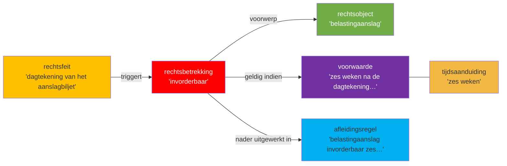
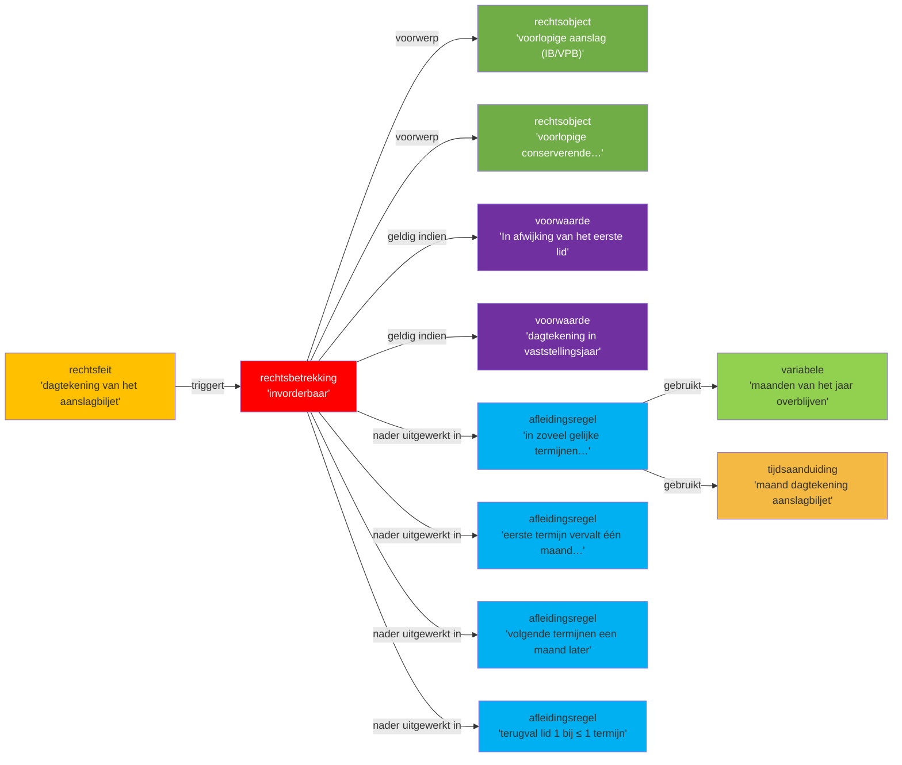

## Wetstekst (letterlijk, peildatum 2026-01-01)

> **1** Een belastingaanslag is invorderbaar zes weken na de dagtekening van het aanslagbiljet.

> **2** In afwijking van het eerste lid is een navorderingsaanslag, alsmede een conserverende navorderingsaanslag invorderbaar één maand na de dagtekening van het aanslagbiljet en een naheffingsaanslag invorderbaar veertien dagen na de dagtekening van het aanslagbiljet.

> **3** Een ingevolge [artikel 2, tweede lid, onderdeel c](jci1.3:c:BWBR0004770&hoofdstuk=I&artikel=2&z=2026-01-01&g=2026-01-01), met een belastingaanslag gelijkgestelde beschikking inzake een bestuurlijke boete die gelijktijdig en in verband met de vaststelling van een belastingaanslag als bedoeld in [artikel 2, eerste lid, onderdeel m](jci1.3:c:BWBR0004770&hoofdstuk=I&artikel=2&z=2026-01-01&g=2026-01-01), is opgelegd, is invorderbaar overeenkomstig de bepalingen die gelden voor die belastingaanslag. Een ingevolge [artikel 2, tweede lid, onderdeel c](jci1.3:c:BWBR0004770&hoofdstuk=I&artikel=2&z=2026-01-01&g=2026-01-01), met een belastingaanslag gelijkgestelde beschikking inzake belasting- of revisierente is invorderbaar overeenkomstig de bepalingen die gelden voor de belastingaanslag, bedoeld in [artikel 2, eerste lid, onderdeel m](jci1.3:c:BWBR0004770&hoofdstuk=I&artikel=2&z=2026-01-01&g=2026-01-01), waarop de belasting- of revisierente betrekking heeft.

> **4** Een uitnodiging tot betaling, alsmede een ingevolge [artikel 2, tweede lid, onderdeel c](jci1.3:c:BWBR0004770&hoofdstuk=I&artikel=2&z=2026-01-01&g=2026-01-01), met een belastingaanslag gelijkgestelde beschikking inzake rente op achterstallen, inzake kosten van ambtelijke werkzaamheden of inzake een bestuurlijke boete als bedoeld in [hoofdstuk 9 van de Algemene douanewet](jci1.3:c:BWBR0023746&hoofdstuk=9), is invorderbaar tien dagen na de dagtekening van het aanslagbiljet.

> **5** In afwijking van het eerste lid is een voorlopige aanslag in de inkomstenbelasting of in de vennootschapsbelasting en een voorlopige conserverende aanslag in de inkomstenbelasting, waarvan het aanslagbiljet een dagtekening heeft die ligt in het jaar waarover deze is vastgesteld, invorderbaar in zoveel gelijke termijnen als er na de maand, die in de dagtekening van het aanslagbiljet is vermeld, nog maanden van het jaar overblijven. De eerste termijn vervalt één maand na de dagtekening van het aanslagbiljet en elk van de volgende termijnen telkens een maand later. Indien de toepassing van de eerste volzin niet leidt tot meer dan één termijn, vindt het eerste lid toepassing.

> **6** In afwijking van het eerste en het vijfde lid is een belastingaanslag als bedoeld in het vijfde lid, die een uit te betalen bedrag behelst, invorderbaar in zoveel gelijke termijnen als er met inbegrip van de maand die in de dagtekening van het aanslagbiljet is vermeld, nog maanden van het jaar overblijven. De eerste termijn vervalt aan het eind van de maand van de dagtekening van het aanslagbiljet en elk van de volgende termijnen telkens een maand later.

> **7** In afwijking van het eerste lid is een voorlopige aanslag waarvan het aanslagbiljet een dagtekening heeft die ligt voor het jaar waarover deze is vastgesteld, invorderbaar in zoveel gelijke termijnen als er maanden van het jaar zijn. De eerste termijn vervalt aan het eind van de eerste maand van het jaar waarover de voorlopige aanslag is vastgesteld en elk van de volgende termijnen telkens een maand later.

> **8** In afwijking van het tweede lid is terstond invorderbaar een naheffingsaanslag ter zake van: a. de belasting van personenauto's en motorrijwielen, die is opgelegd aan een ander dan een vergunninghouder als bedoeld in [artikel 8 van de Wet op de belasting van personenauto's en motorrijwielen 1992](jci1.3:c:BWBR0005806&artikel=8), of b. de belasting zware motorrijtuigen, die is opgelegd aan de houder van een ander motorrijtuig dan bedoeld in [artikel 6, onderdeel a, van de Wet belasting zware motorrijtuigen](jci1.3:c:BWBR0007678&artikel=6).

> **9** In afwijking van het vierde lid is een uitnodiging tot betaling die is vastgesteld overeenkomstig een op een kalendermaand betrekking hebbende, aanvullende aangifte als bedoeld in artikel 167, eerste lid, van het Douanewetboek van de Unie invorderbaar vijftien dagen na de maand waarover de aangifte is gedaan. In afwijking in zoverre van de eerste volzin is de uitnodiging tot betaling ter zake van de aangifte over de maand februari invorderbaar na zestien maart.

> **10** De [Algemene termijnenwet](jci1.3:c:BWBR0002448) is niet van toepassing op de in de voorgaande leden gestelde termijnen.

> **11** In afwijking van het eerste lid is een belastingaanslag die een uit te betalen bedrag behelst niet invorderbaar: a. zolang over de juistheid van het adresgegeven van de belastingschuldige gerede twijfel bestaat of zolang dit gegeven ontbreekt; b. indien er op het moment dat er na het tijdstip waarop de belastingschuld is ontstaan vijf jaren zijn verstreken: 1°. gerede twijfel bestaat over de juistheid van het adresgegeven van de belastingschuldige; of 2°. het adresgegeven van de belastingschuldige ontbreekt.

> **12** De verplichting tot betaling wordt niet geschorst door de indiening van een bezwaar- of beroepschrift inzake een belastingaanslag.

## Annotatietabel

*Scope: leden 1 en 5. Overige leden nog niet geannoteerd.*

| Nr | Markering (letterlijk incl. lidwoord en verwijzingen) | JAS-klasse | Interpretatiemethode | Begrip | Signalering |
|----|------------------------------------------------------|-----------|---------------------|--------|-------------|
| 1 | "Een belastingaanslag" | **rechtsobject** | grammaticaal | [[begrippen/belastingaanslag]] | — |
| 2 | "is invorderbaar" | **rechtsbetrekking** | grammaticaal | [[begrippen/invorderbaarheid]] | ⚠ rechtssubjecten (belastingschuldige, ontvanger) niet expliciet benoemd in lid 1; impliciet via art. 2 en 3 IW 1990 |
| 3 | "zes weken na de dagtekening van het aanslagbiljet" | **voorwaarde** | grammaticaal | [[begrippen/zes-weken-na-dagtekening-aanslagbiljet]] | — |
| 4 | "zes weken" | **tijdsaanduiding** | grammaticaal | [[begrippen/zes-weken]] | — |
| 5 | "de dagtekening van het aanslagbiljet" | **tijdsaanduiding** | systematisch | [[begrippen/dagtekening-aanslagbiljet]] | ⚠ dubbelclassificatie: ook rechtsfeit (nr. 6); dagtekening markeert zowel het aanvangstijdstip van de invorderingstermijn als het rechtsscheppende moment dat de termijn doet ingaan |
| 6 | "de dagtekening van het aanslagbiljet" | **rechtsfeit** | systematisch | [[begrippen/dagtekening-aanslagbiljet]] | ⚠ hergebruik begrip-noot (zie nr. 5); als rechtsfeit: de dagtekening is de handeling waaraan het rechtsgevolg (aanvang invorderingstermijn) is verbonden |
| 7 | "Een belastingaanslag is invorderbaar zes weken na de dagtekening van het aanslagbiljet." | **afleidingsregel** | systematisch | [[begrippen/invorderbaarheid-belastingaanslag]] | — |
| | *Lid 5* | | | | |
| 8 | "een voorlopige aanslag in de inkomstenbelasting of in de vennootschapsbelasting" | **rechtsobject** | grammaticaal | [[begrippen/voorlopige-aanslag]] | — |
| 9 | "of" | **operator** | grammaticaal | [[begrippen/logische-of]] | ⚠ logische OR; verbindt IB en VPB als alternatieve belastingsoorten voor het toepassingsbereik van lid 5 |
| 10 | "een voorlopige conserverende aanslag in de inkomstenbelasting" | **rechtsobject** | grammaticaal | [[begrippen/voorlopige-conserverende-aanslag-ib]] | — |
| 11 | "is ... invorderbaar" | **rechtsbetrekking** | grammaticaal | [[begrippen/invorderbaarheid]] | ⚠ hergebruik begrip-noot; rechtssubjecten niet expliciet in lid 5; impliciet via art. 3 IW 1990 |
| 12 | "In afwijking van het eerste lid" | **voorwaarde** | systematisch | [[begrippen/in-afwijking-van-eerste-lid]] | ⚠ specialisatiebepaling; markeert lid 5 als lex specialis t.o.v. art. 9 lid 1 voor de genoemde voorlopige aanslagen |
| 13 | "waarvan het aanslagbiljet een dagtekening heeft die ligt in het jaar waarover deze is vastgesteld" | **voorwaarde** | grammaticaal | [[begrippen/dagtekening-in-vaststellingsjaar]] | ⚠ kwalificatieconditie: beperkt lid 5 tot aanslagen met een dagtekening in het belastingjaar; aanslagen vóór het jaar vallen onder lid 7 |
| 14 | "de dagtekening van het aanslagbiljet" | **rechtsfeit** | systematisch | [[begrippen/dagtekening-aanslagbiljet]] | ⚠ hergebruik begrip-noot; hier als ankerpunt voor de termijnenberekening in lid 5 |
| 15 | "de maand, die in de dagtekening van het aanslagbiljet is vermeld" | **tijdsaanduiding** | grammaticaal | [[begrippen/maand-dagtekening-aanslagbiljet]] | — |
| 16 | "in zoveel gelijke termijnen als er na de maand, die in de dagtekening van het aanslagbiljet is vermeld, nog maanden van het jaar overblijven" | **afleidingsregel** | systematisch | [[begrippen/termijnenberekening-resterende-maanden]] | — |
| 17 | "nog maanden van het jaar overblijven" | **variabele** | grammaticaal | [[begrippen/resterende-maanden-jaar]] | — |
| 18 | "In afwijking van het eerste lid is een voorlopige aanslag in de inkomstenbelasting of in de vennootschapsbelasting en een voorlopige conserverende aanslag in de inkomstenbelasting, waarvan het aanslagbiljet een dagtekening heeft die ligt in het jaar waarover deze is vastgesteld, invorderbaar in zoveel gelijke termijnen als er na de maand, die in de dagtekening van het aanslagbiljet is vermeld, nog maanden van het jaar overblijven." | **afleidingsregel** | systematisch | [[begrippen/invorderbaarheid-in-gelijke-termijnen]] | ⚠ specialisatieregel t.o.v. art. 9 lid 1; als-dan: als aan beide kwalificatievoorwaarden is voldaan (aanslagtype én dagtekening in jaar), dan invorderbaar in gelijke maandelijkse termijnen |
| 19 | "De eerste termijn vervalt één maand na de dagtekening van het aanslagbiljet" | **afleidingsregel** | grammaticaal | [[begrippen/vervaldag-eerste-termijn]] | — |
| 20 | "één maand na de dagtekening van het aanslagbiljet" | **tijdsaanduiding** | grammaticaal | [[begrippen/een-maand-na-dagtekening]] | — |
| 21 | "elk van de volgende termijnen telkens een maand later" | **afleidingsregel** | grammaticaal | [[begrippen/vervaldag-volgende-termijnen]] | — |
| 22 | "telkens een maand later" | **tijdsaanduiding** | grammaticaal | [[begrippen/telkens-een-maand-later]] | — |
| 23 | "Indien de toepassing van de eerste volzin niet leidt tot meer dan één termijn, vindt het eerste lid toepassing." | **afleidingsregel** | systematisch | [[begrippen/terugvalregel-lid-1]] | ⚠ beslissingsregel (terugvalregel); art. 9 lid 1 herneemt toepassing als het termijnenantal ≤ 1 is (bij dagtekening in december) |

## Diagram

### Diagram 1 — lid 1: invorderbaarheid van de belastingaanslag

### Diagram 2 — lid 5: invorderbaarheid van voorlopige aanslagen in gelijke termijnen

## Delegatiestructuur

Geen delegatiebevoegdheden in artikel 9.
