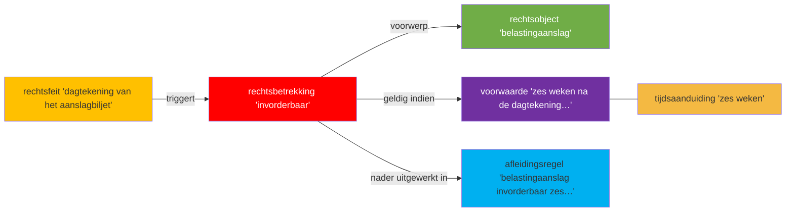

## Wetstekst lid 1 (letterlijk)

> **1** Een belastingaanslag is invorderbaar zes weken na de dagtekening van het aanslagbiljet.

*Hoofdstuk II Invordering in eerste aanleg > Artikel 9 > Lid 1*

## Annotatietabel

| Nr | Markering | JAS-klasse | Methode | Begrip | Signalering |
|----|-----------|-----------|---------|--------|-------------|
| r-001 | Een belastingaanslag | **rechtsobject** | grammaticaal | [[views/begrippen/belastingaanslag]] | — |
| r-002 | is invorderbaar | **rechtsbetrekking** | grammaticaal | [[views/begrippen/invorderbaarheid]] | ⚠ rechtssubjecten (belastingschuldige, ontvanger) niet expliciet benoemd in lid 1; impliciet via art. 2 en 3 IW 1990 |
| r-003 | zes weken na de dagtekening van het aanslagbiljet | **voorwaarde** | grammaticaal | [[views/begrippen/zes-weken-na-dagtekening-aanslagbiljet]] | — |
| r-004 | zes weken | **tijdsaanduiding** | grammaticaal | [[views/begrippen/zes-weken]] | — |
| r-005 | de dagtekening van het aanslagbiljet | **tijdsaanduiding** | systematisch | [[views/begrippen/dagtekening-aanslagbiljet]] | ⚠ dubbelclassificatie: ook rechtsfeit (nr. 6); dagtekening markeert zowel het aanvangstijdstip van de invorderingstermijn als het rechtsscheppende moment dat de termijn doet ingaan |
| r-006 | de dagtekening van het aanslagbiljet | **rechtsfeit** | systematisch | [[views/begrippen/dagtekening-aanslagbiljet]] | ⚠ hergebruik begrip-noot (zie nr. 5); als rechtsfeit: de dagtekening is de handeling waaraan het rechtsgevolg (aanvang invorderingstermijn) is verbonden |
| r-007 | Een belastingaanslag is invorderbaar zes weken na de dagtekening van het aanslagbiljet. | **afleidingsregel** | systematisch | [[views/begrippen/invorderbaarheid-belastingaanslag]] | — |

## Diagram

## Delegatiestructuur

Geen delegatiebevoegdheden.
